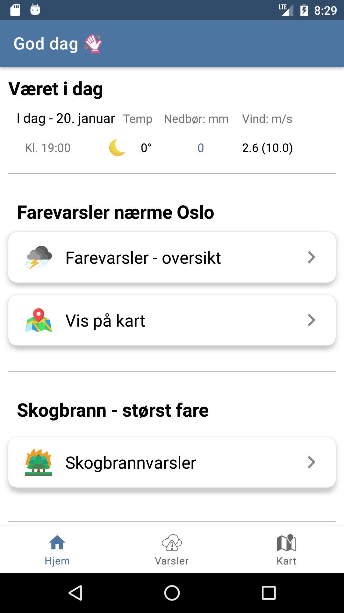
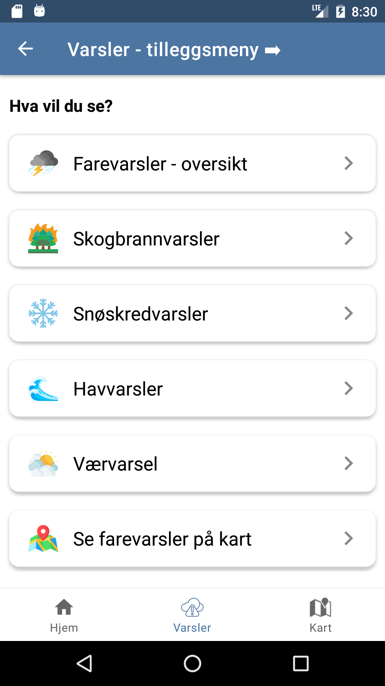
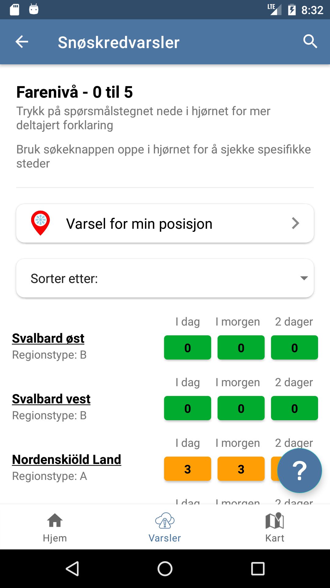
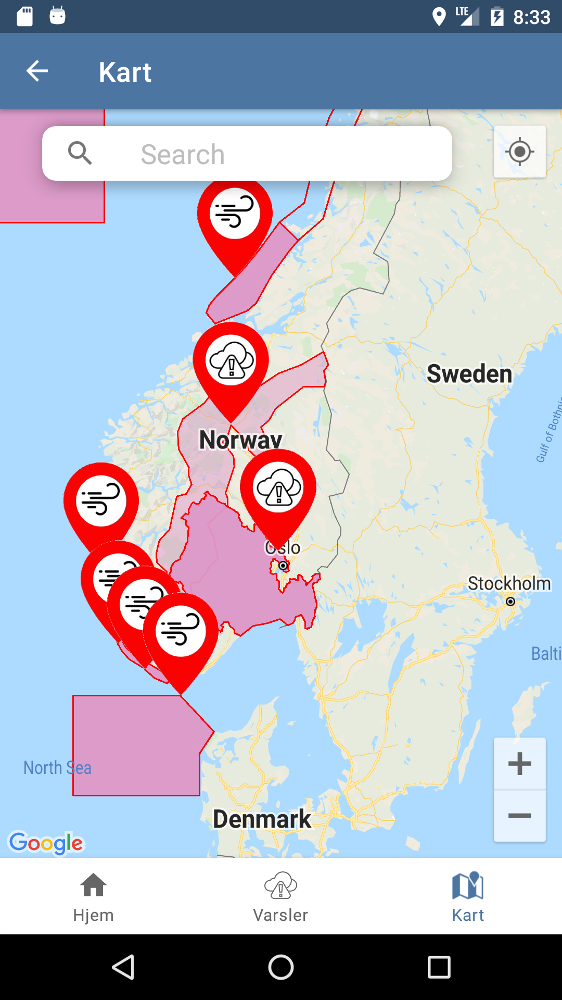

# Weather Warnings in Norway

## Project description
This application provides weather forecast and danger warnings in Norway. It is developed by a group of students at UiO. 

## Demonstration of features:
**Home page:**

The home page displays an overview of the apps content.
On the top we have the weatherforcast for the rest of the day, in the we have the danger warnings near the users position. The user can scroll down to see other types of warnings. By clicking on them, the system navigates to a new page.

**Menu page:**

By clicking the second tab on navigation bar users sees a menu of all types of danger warnings. He or she can click on those items to get more information.

**Example: Avalanche danger**

Dangers can also be sorted in alphabetical order according to the name of the place, or according to the level of risk.

**Map:**

Users can also get see the warnings on a map. By clicking on marked areas the system navigates to a new page with detailed information.

## Technologies used:
Language: Kotlin

API: Gson, Fuel,

Map: Google Maps, Google Places

Testing: Espresso, JUnit, Mockito
